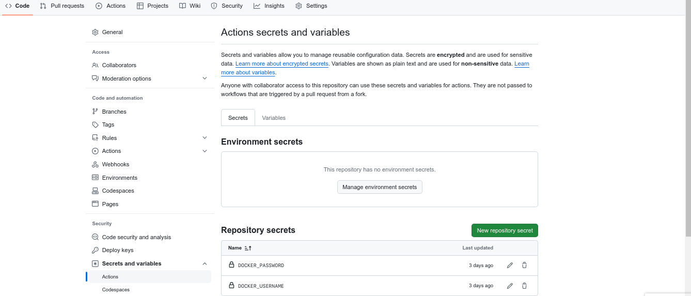

# cicd

## Github Actions
**Repository** - https://github.com/wseyi/jenkins-maven

### Steps
1. Fork the repository
2. Go to settings in the repository and create your secret docker hub username and password which will be used to log into docker hub.
   
3. Go to actions and select new workflow then click the **"set up a workflow yourself"** link.
   
4. Copy script from workflow.yaml file
   

## Jenkins Pipeline
### Link to github repository
https://github.com/wseyi/jenkins-maven

#### Steps
1. Click on New item.
2. Name your item and select pipeline plug-in and click ok.
3. When configuring select github project and put the repository url. 
   
4. Copy and paste the script from jenkinsfile into the pipeline section.
   
5. Save and click build now.